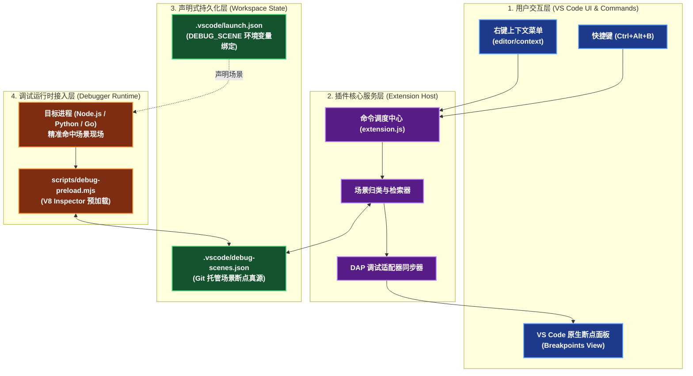
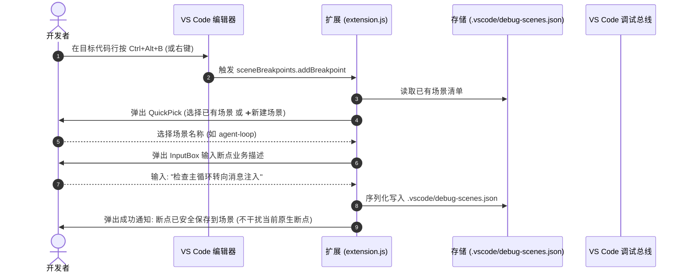
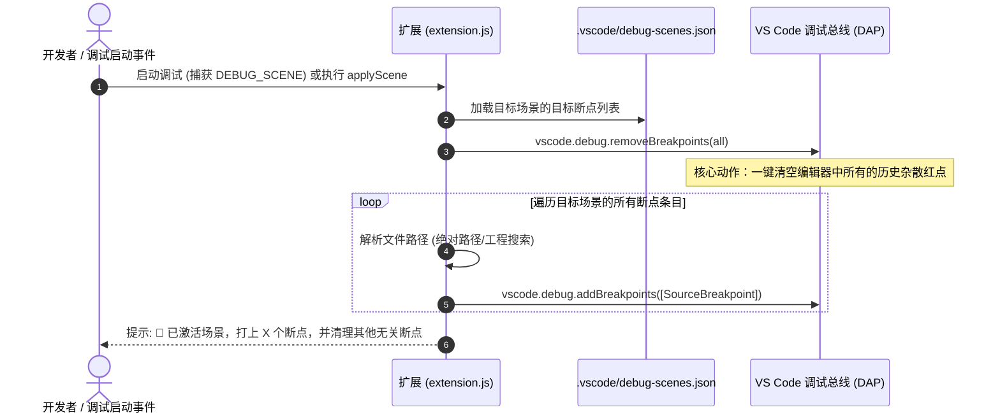

# Scene Breakpoints Manager 软件设计与架构文档 (SDD)

> **文档定位**：本文档系统阐述 `Scene Breakpoints Manager`（VS Code 场景化断点管理扩展）的设计动机、分层架构、数据契约、核心交互时序及技术权衡。

---

## 目录
1. [背景与核心痛点](#一背景与核心痛点)
2. [总体架构与分层设计](#二总体架构与分层设计)
3. [数据模型规范 (Data Schema)](#三数据模型规范-data-schema)
4. [核心业务流转时序图](#四核心业务流转时序图)
5. [关键技术创新与工程权衡](#五关键技术创新与工程权衡)
6. [跨语言与通用性扩展机制](#六跨语言与通用性扩展机制)

---

## 一、背景与核心痛点

在大型开源项目或复杂的业务系统中（如包含 ReAct 决策循环、状态机推进与异步工具链的 Pi Agent），开发者在阅读与调试代码时面临四个普遍痛点：

| 痛点场景 | 传统 VS Code 调试体验 | 本系统解决方案 |
| :--- | :--- | :--- |
| **断点无语义与备注** | 断点列表中只有冰冷的 `agent-loop.ts 175`，打多了之后根本记不起当初为什么打这个点。 | 支持在右键录入**中文描述**保存至场景配置，激活场景时直接在编辑器与断点面板呈现。 |
| **多场景杂散断点干扰** | 调试“工具执行”时，之前在“登录鉴权”留下的十几个历史断点频繁被无故暂停，极度打断思路。 | **场景隔离与自动净化**：激活当前场景时，自动清理其他无关断点。 |
| **断点无法跨机器同步** | 断点默认保存在本地机器的 VS Code 隐式 SQLite 缓存中，提交 Git 后换电脑或团队协作全部丢失。 | 声明式持久化到工程文件 **`.vscode/debug-scenes.json`**，天然随 Git 跨电脑无缝同步。 |
| **启动链路割裂** | 必须先手动找到源码行号打点，再点击调试。 | **与 `launch.json` 深度结合**：选择 Profile 点击 F5，自动完成断点下发与直达。 |

---

## 二、总体架构与分层设计

系统由 **VS Code 扩展交互层**、**工作区声明式配置层** 与 **调试运行时执行层** 三层闭环构成：



---

## 三、数据模型规范 (Data Schema)

场景断点数据存储于根目录的 `.vscode/debug-scenes.json`。数据模型设计遵循轻量、高可读与结构化原则：

```json
{
  "$schema": "https://json-schema.org/draft/2020-12/schema",
  "scenes": {
    "<scene-name>": [
      {
        "file": "<relative-or-absolute-file-path>",
        "line": 175,
        "desc": "<human-readable-comment>"
      }
    ]
  }
}
```

### 字段说明与寻址策略：
- **`scene-name` (string)**：场景唯一标识（如 `agent-loop`、`tool-execution`、`file-edit`）。
- **`file` (string)**：支持两种寻址格式：
  1. **工程相对路径**（推荐）：`packages/agent/src/agent-loop.ts`，防止同名文件冲突；
  2. **文件名纯 BaseName**：`agent-loop.ts`，扩展在加载时会自动执行模糊文件寻址。
- **`line` (number)**：1-based 源码物理行号。
- **`desc` (string, 可选)**：断点的业务意图说明。

---

## 四、核心业务流转时序图

### 1. 添加并保存场景断点流 (Add Breakpoint Flow)



---

### 2. 场景切换与断点净化流 (Apply Scene & Clean Flow)



---

## 五、关键技术创新与工程权衡

### 1. 突破 VS Code 断点无描述限制：“条件注释法”
- **原生缺陷**：VS Code 原生的 `SourceBreakpoint` 只接受 `condition`（布尔表达式），不提供 `label` 字段。
- **创新解法**：扩展在注入断点时，巧妙利用了 JS/TS 解析器的注释语法，将断点条件构造为：
  ```javascript
  /* 你的中文描述 */ true
  ```
- **收益**：
  1. 运行时计算恒为 `true`，**100% 保持无条件断点的必停特性**；
  2. VS Code 断点面板在渲染表达式时，会直接将 `/* 你的中文描述 */ true` 完整打印在列表右侧，一眼即知断点业务意图。

### 2. 运行时双重过滤机制 (Defense-in-Depth)
为了实现“绝对不被杂散断点打扰”，系统设计了**双重安全网**：
1. **第一重（编辑器界面层 - 插件接管）**：
   在启动时主动调用 `removeBreakpoints` 清除非目标断点，视觉上保持干净。
2. **第二重（进程引擎层 - preload 脚本接管）**：
   在 [scripts/debug-preload.mjs](../../scripts/debug-preload.mjs) 中挂载 V8 的 `Debugger.paused` 钩子。即便有未被清理的幽灵断点暂停，脚本会比对当前物理位置；若不在当前场景列表中，**底层自动触发 `Debugger.resume` 瞬间放行**，确保主逻辑毫秒级穿透，直达目标场景。

### 3. 零编译、零依赖的高可移植性 (Zero-Build Design)
- **拒绝重量级 Webpack/Vite 捆绑**：扩展直接采用纯 CommonJS 原生实现（`extension.js`），无任何第三方 npm 运行时依赖。
- **免安装打包**：无需发布到外网 Marketplace，通过本地目录软链接或目录拷贝（`install.bat` / `install.ps1`）秒级部署。

---

## 六、跨语言与通用性扩展机制

虽然本项目宿主为 TypeScript，但本扩展的架构设计在本质上是**全语言通用的**：

```
[UI 交互] 右键输入描述 
    │
    ▼
[通用协议] 提取通用 JSON ({ file, line, desc })
    │
    ▼
[DAP 总线] vscode.debug.addBreakpoints(...) 
    │
    ├─► Node.js / TypeScript 调试器 (pwa-node)
    ├─► Python 调试器 (debugpy)
    ├─► Go 调试器 (delve)
    ├─► C / C++ 调试器 (cppdbg / lldb)
    └─► Java 调试器 (java-debug)
```

因为操作的目标是 VS Code 顶级抽象的 `vscode.debug` API（Debug Adapter Protocol），无论底层换成 Python 脚本、Go 单元测试还是 C++ 可执行文件，插件都可以在启动瞬间准确完成断点装载与杂散清理。
