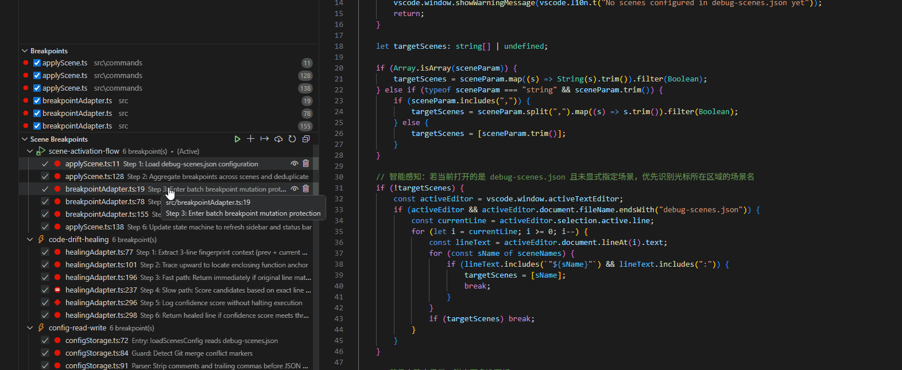

<div align="center">
  
  <h1>Scene Breakpoints</h1>
  <p><b>Lightweight scenario-driven breakpoint orchestrator for code reading and complex debugging</b></p>

  <p>
    <a href="https://github.com/Tonys-L/scene-breakpoints-vscode"></a>
    <a href="https://github.com/Tonys-L/scene-breakpoints-vscode/blob/main/LICENSE"></a>
    <a href="https://github.com/Tonys-L/scene-breakpoints-vscode/blob/main/docs/guide.md"></a>
  </p>

  <p><b>English</b> | <a href="https://github.com/Tonys-L/scene-breakpoints-vscode/blob/main/README_zh.md">简体中文</a></p>
</div>

---

## 💡 Why This Extension?

Every developer debugging in VS Code runs into these frustrations:
1. **Too many leftover breakpoints interrupting your flow**: You have dozens of breakpoints scattered from previous debugging sessions. Starting a new task pauses execution every two seconds.
2. **Complex call chains are easily forgotten**: You spend hours tracing a multi-file execution path, but forget key steps weeks later. Onboarding teammates face the same steep curve.
3. **Pulling git or editing code breaks your breakpoints**: Whenever lines shift, your saved breakpoints end up on empty lines or comments.
4. **Impossible to share or sync across computers**: Native breakpoints vanish when you switch laptops, and sharing a debug setup with teammates means manually typing out file paths and line numbers.

**Scene Breakpoints** is your **breakpoint organizer & execution tour guide**: group breakpoints by feature with descriptive notes, switch them in seconds, and share them via Git.

---

## ✨ What Can It Do For You?

<p align="center">
  
</p>

- 🗺️ **Document Execution Flows into Living Code Maps**
  Attach clear notes to each breakpoint (e.g. `Step 1: Auth Guard`, `Step 2: Decrement Inventory`). A scene becomes a self-guided walkthrough for complex codebases.

- 🎯 **Switch Scenarios, Keep Only What You Need**
  Switching to "Login" only enables breakpoints for login. All unrelated breakpoints are cleanly cleared so you never get interrupted.

- 🛡️ **Code Drift Self-Healing**
  Did you pull upstream commits or add a few lines? The extension recognizes the surrounding code and automatically snaps breakpoints to their true lines.

- 🔄 **Set Breakpoints Naturally, Save with One Click**
  Debug as usual with your mouse. When it works, click once to "Export Current Breakpoints to Scene"—no manual JSON editing needed.

- 🌲 **Checklist-Style Sidebar Management**
  View all your scenes in the "Run & Debug" panel. Click checkboxes to toggle breakpoints or layer multiple scenes together.

- ⚡ **Auto-Load on F5**
  Link your launch profiles to a scene. Pressing F5 automatically prepares the right breakpoints before the debugger starts.

---

## 🚀 Quick Start

### 1. Installation

- **From Marketplace**: Search for `Scene Breakpoints` in the Extensions view (`Ctrl+Shift+X` / `Cmd+Shift+X`) and click Install;
- **From VSIX**: In Extensions view, click `...` $\rightarrow$ `Install from VSIX...`.

### 2. 3-Step Walkthrough

1. **Add Breakpoint**: Right-click on any line and choose `Add to Debug Scene...`, or press `Ctrl + Alt + B` (`Cmd + Alt + B` on macOS), select a scene, and enter a note;

<p align="center">
  
</p>

2. **Switch Scene**: Click the status bar item at the bottom (or press `Ctrl + Alt + S` / `Cmd + Alt + S` on macOS) to activate one or more scenes;

<p align="center">
  
</p>

3. **Export Active**: After placing breakpoints freely in code, run `Scene: Export Current Breakpoints to Scene...` from the command palette to persist them.

---

## ⌨️ Shortcuts

| Shortcut (Windows/Linux) | Shortcut (macOS) | Description |
| :--- | :--- | :--- |
| `Ctrl + Alt + S` | `Cmd + Alt + S` | Open Scene Control Menu / Switch & Multi-select scenes (or click Status Bar) |
| `Ctrl + Alt + B` | `Cmd + Alt + B` | Add current line to scene with a description |

---

## 📝 Configuration Example (`.vscode/debug-scenes.json`)

Presets are stored in declarative JSON at `.vscode/debug-scenes.json`, with built-in CodeLens buttons and schema validation:

<p align="center">
  
</p>

```json
{
  "$schema": "https://raw.githubusercontent.com/Tonys-L/scene-breakpoints-vscode/main/schema.json",
  "bindings": {
    "Launch API Server": "login-debug"
  },
  "scenes": {
    "login-debug": [
      {
        "type": "line",
        "file": "src/auth.ts",
        "line": 45,
        "desc": "Token verification entry"
      },
      {
        "type": "condition",
        "file": "src/auth.ts",
        "line": 89,
        "condition": "user.isVip === true",
        "desc": "Intercept only for VIP users"
      },
      {
        "type": "logpoint",
        "file": "src/agent-loop.ts",
        "line": 104,
        "logMessage": "Current status: {state.status}",
        "desc": "Non-intrusive runtime trace"
      }
    ]
  }
}
```

---

## 📖 Documentation

- 📘 [Complete User Guide & FAQ](https://github.com/Tonys-L/scene-breakpoints-vscode/blob/main/docs/guide.md)
- 📝 [Changelog (CHANGELOG.md)](https://github.com/Tonys-L/scene-breakpoints-vscode/blob/main/CHANGELOG.md)

---

## 📄 License

[MIT License](https://github.com/Tonys-L/scene-breakpoints-vscode/blob/main/LICENSE) © 2026 Tony.L
