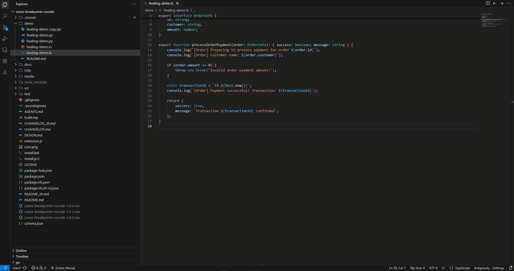
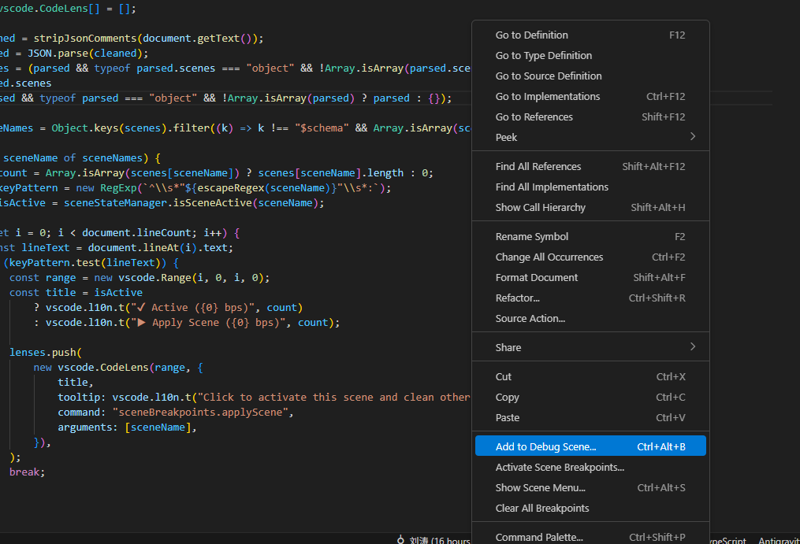
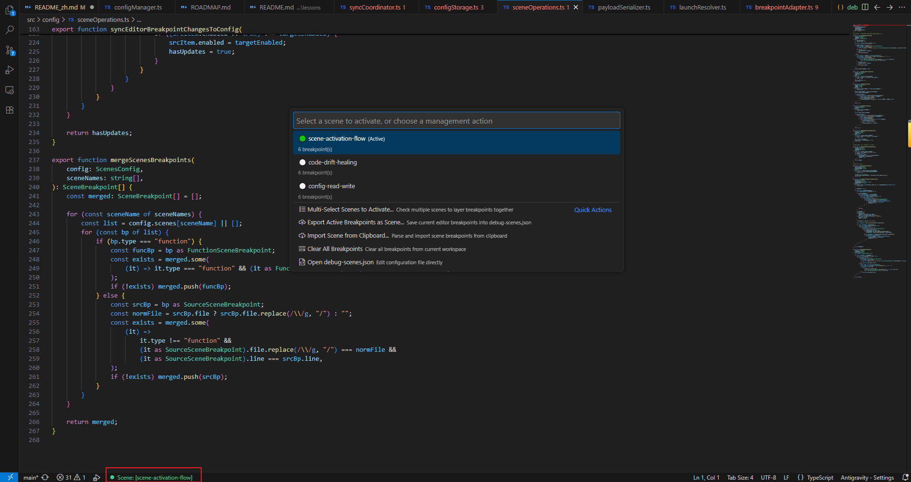
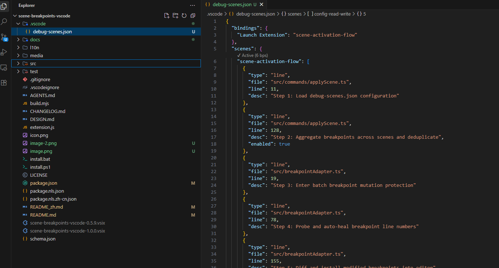

<div align="center">
  
  <h1>场景断点 (Scene Breakpoints)</h1>
  <p><b>专为代码研读与复杂链路排查打造的 VS Code 场景化断点管理工具</b></p>

  <p>
    <a href="https://github.com/Tonys-L/scene-breakpoints-vscode"></a>
    <a href="https://marketplace.visualstudio.com/items?itemName=Tony-L.scene-breakpoints-vscode"></a>
    <a href="https://open-vsx.org/extension/tony-l/scene-breakpoints-vscode"></a>
    <a href="https://github.com/Tonys-L/scene-breakpoints-vscode/actions/workflows/ci.yml"></a>
    <a href="https://github.com/Tonys-L/scene-breakpoints-vscode/releases"></a>
    <a href="https://github.com/Tonys-L/scene-breakpoints-vscode/blob/main/LICENSE"></a>
    <a href="https://github.com/Tonys-L/scene-breakpoints-vscode/blob/main/docs/guide_zh.md"></a>
  </p>

  <p><a href="https://github.com/Tonys-L/scene-breakpoints-vscode/blob/main/README.md">English</a> | <b>简体中文</b></p>
</div>

---

## 💡 为什么需要这个插件？

平时在 VS Code 里调试代码，大家经常会遇到这几个头疼事：
1. **断点太多舍不得删，调试时到处乱停**：平时查各种问题留了几十个断点，查新 Bug 时走两步就误停一次，烦躁得不行；
2. **复杂调用链理顺了，过两天就忘光**：好不容易理清一条横跨十几个文件的复杂业务链路，过两周又忘了关键步骤在哪，新人接手更是一头雾水；
3. **Pull 一下代码或改了几行，断点全偏了**：代码行号一变，原来的断点全停在空行或注释上，彻底失效；
4. **想把断点分享给同事，换电脑断点全丢**：只能打字告诉同事“你在 xx 文件的 88 行打个断点”，换台电脑之前打的断点全没了。

**Scene Breakpoints** 就是你的**断点分组与链路导览器**：把断点按业务场景分组，带上步骤备注，随切随用，自动随 Git 团队共享。

---

## ✨ 它能帮你做什么？

<p align="center">
  
</p>

- 🗺️ **记录业务关键流程，秒变代码路线图**
  给每个断点写上中文备注（例如 `步骤1: 权限校验`、`步骤2: 扣减库存`）。一个场景就是一条完整的业务主干执行图，顺藤摸瓜看懂复杂源码，再也不用担心遗忘。

- 🎯 **切到哪个场景，就只留哪组断点**
  切到“登录”，VS Code 里就只生效登录的断点，其他无关断点自动藏起来；切到“支付”，就只断支付，绝不瞎停。

- 🛡️ **行号变了，断点自动找回（防漂移）**
  拉取了最新代码或改动了行号？激活场景时，插件会自动根据代码内容把断点精准吸附到新行号上，再也不用手动重打。

- 🔄 **随手打断点，一键另存为分组**
  不用专门去写配置文件。平时该怎么打断点就怎么打，调通后点一下“导出为新场景”，直接打包存盘。

- 🌲 **侧边栏像清单一样打勾管理**
  在左侧“运行与调试”面板里直接看所有场景，点击复选框随手开启/关闭某个断点，还能同时勾选多个场景一起生效。

- ⚡ **按 F5 启动调试，自动加载对应断点**
  在 `launch.json` 里配好名字，按 F5 启动调试时，自动把关联场景的断点打好，不用每次手动切。

---

## 🚀 快速上手

### 1. 安装方式

- **扩展面板搜索**：在 VS Code 扩展市场搜索 `Scene Breakpoints` 直接安装；
- **VSIX 文件安装**：在扩展面板点击右上角 `...` $\rightarrow$ 选择 `从 VSIX 安装...`。

### 2. 三步上手流程

1. **添加断点**：在任意代码行右键选择 `Add to Debug Scene...`，或者直接按下快捷键 `Ctrl + Alt + B`（macOS: `Cmd + Alt + B`），选择场景并输入备注；

<p align="center">
  
</p>

2. **切换场景**：点击 VS Code 底部状态栏（或按下快捷键 `Ctrl + Alt + S` / macOS: `Cmd + Alt + S`），选择场景一键激活；

<p align="center">
  
</p>

3. **反向导出**：在编辑器打好断点后，在命令面板输入 `Scene: 将当前所有断点导出为新场景` 一键固化存盘。

---

## ⌨️ 快捷键速查

| 快捷键 (Windows/Linux) | 快捷键 (macOS) | 功能说明 |
| :--- | :--- | :--- |
| `Ctrl + Alt + S` | `Cmd + Alt + S` | 呼出场景控制菜单 / 快速切换与多选场景（亦可点击底部状态栏） |
| `Ctrl + Alt + B` | `Cmd + Alt + B` | 将当前代码行保存到指定场景并输入备注 |

---

## 📝 配置文件示例 (`.vscode/debug-scenes.json`)

断点数据以纯文本声明式保存在工作区 `.vscode/debug-scenes.json` 中，自带代码透视（CodeLens）一键激活与语法提示：

<p align="center">
  
</p>

```json
{
  "$schema": "https://raw.githubusercontent.com/Tonys-L/scene-breakpoints-vscode/main/schema.json",
  "bindings": {
    "Launch API Server": "login-debug"
  },
  "scenes": {
    "login-debug": [
      {
        "type": "line",
        "file": "src/auth.ts",
        "line": 45,
        "desc": "Token 校验入口"
      },
      {
        "type": "condition",
        "file": "src/auth.ts",
        "line": 89,
        "condition": "user.isVip === true",
        "desc": "仅在 VIP 用户登录时拦截"
      },
      {
        "type": "logpoint",
        "file": "src/agent-loop.ts",
        "line": 104,
        "logMessage": "Current status: {state.status}",
        "desc": "输出状态不暂停"
      }
    ]
  }
}
```

---

## 🤖 AI Agent 协同与一键 Skill 赋能

Scene Breakpoints 原生设计为 **AI 友好**，无需借助外部复杂 MCP 服务，即可实现与主流 AI 编程助手的无缝联动：

### 1. 免 MCP 声明式断点激活
- AI 只需声明式修改 `.vscode/debug-scenes.json` 根级字段 `"activeScenes": ["target-flow"]` 并保存，插件内部的 FileWatcher 将自动感应，秒级重刷断点并点亮状态栏。
- 用户默认拥有绝对控制权（设置项 `sceneBreakpoints.allowAiFileActivation` 可一键开启/关闭外部文件激活授权）。

### 2. 8 大主流 VS Code AI Agent Skill 一键部署
按 `Ctrl+Shift+P` 执行 **`Scene Breakpoints: Install Agent Skill (安装 Skill)`**，即可一键将 `scene-breakpoints` 专属技能部署到工作区：
- **Antigravity**: `.agents/skills/scene-breakpoints/SKILL.md`
- **Cursor IDE**: `.cursor/rules/scene-breakpoints.mdc`
- **Windsurf**: `.windsurf/rules/scene-breakpoints.md`
- **Cline (Claude Dev)**: `.clinerules/scene-breakpoints.md`
- **Roo Code**: `.roorules/scene-breakpoints.md`
- **Continue.dev**: `.continue/prompts/scene-breakpoints.prompt`
- **GitHub Copilot**: `.github/skills/scene-breakpoints/SKILL.md`
- **Trae IDE**: `.trae/skills/scene-breakpoints/SKILL.md`

安装后，向 AI 说一句：“*帮我分析登录失败的原因，并建立断点场景*”，AI 便会自动研读代码、组织断点并写入场景激活！

### 3. AI 集成状态全维诊断
按 `Ctrl+Shift+P` 执行 **`Scene Breakpoints: Diagnose AI Integration (AI 集成状态诊断)`**，可一目了然查看当前各平台 Skill 部署情况、授权状态并提供一键修复。

---

## 📖 更多文档

- 📕 [完整使用指南与常见问题 (FAQ)](https://github.com/Tonys-L/scene-breakpoints-vscode/blob/main/docs/guide_zh.md)
- 📝 [版本更新日志 (CHANGELOG_zh.md)](https://github.com/Tonys-L/scene-breakpoints-vscode/blob/main/CHANGELOG_zh.md)

---

## 📄 开源许可

[MIT License](https://github.com/Tonys-L/scene-breakpoints-vscode/blob/main/LICENSE) © 2026 Tony.L
