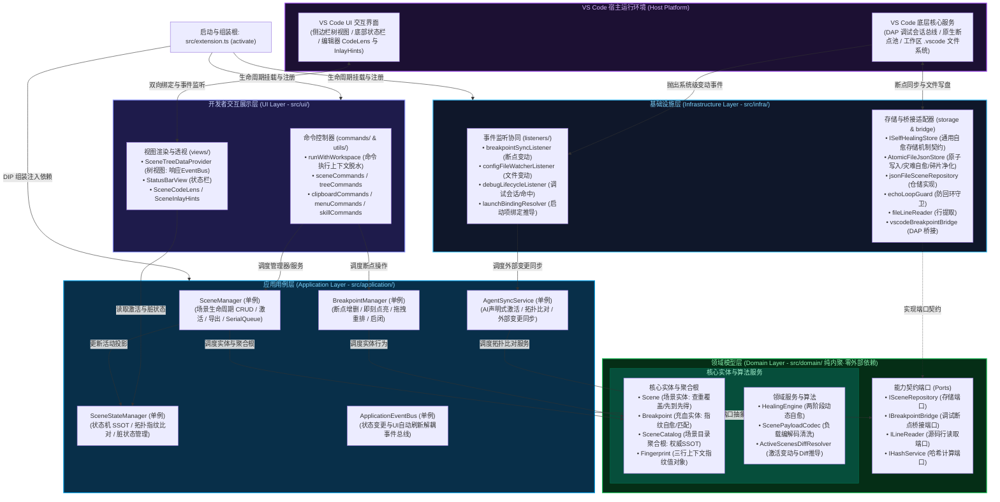

# 系统架构全景 (System Architecture)

> **文档定位**：系统宏观架构全景图。展示整洁架构分层、模块依赖方向与装配拓扑。

---

## 总体架构全景图

---

## 架构分层简述

| 层次 | 目录 | 核心职责 | 依赖规则 |
|---|---|---|---|
| **开发者展示层 (UI)** | `src/ui/` | 负责 VS Code 原生界面交互（树视图、状态栏、CodeLens、InlayHints、Commands）。仅发起用例与消费只读投影，不持有主业务状态。 | 依赖 Application 与 Domain 纯类型 |
| **应用用例层 (Application)** | `src/application/` | 负责用例编排与并发控制。包含实体生命周期管理（`SceneManager`, `BreakpointManager`）、跨模块协同（`AgentSyncService`）与活动投影（`SceneStateManager`）。内置 `SerialQueue` 串行队列。 | 仅依赖 Domain 端口与纯类型，无宿主 API 依赖 |
| **核心领域层 (Domain)** | `src/domain/` | 负责业务规则与算法（100% 纯 TS）。包含充血聚合实体（`SceneCatalog`, `Scene`, `Breakpoint`）、两阶段自愈（`HealingEngine`）及端口契约（Ports）。 | 零外部依赖，严禁导入 `vscode` 或具体 Infra |
| **基础设施层 (Infra)** | `src/infra/` | 负责外部技术适配。包含磁盘原子持久化与防回环守卫（`storage/`）、VS Code DAP 断点桥接与宿主事件监听器（`vscode/`）。 | 实现 Domain 端口契约，适配外部宿主环境 |
| **装配根 (Composition Root)** | `src/extension.ts` | 负责单例实例化、依赖倒置注入（DIP）与 VS Code 生命周期钩子挂载。 | 插件唯一胶水入口 |

---

## 核心架构原则速查

1. **严格单向依赖与禁止跨层调用**：
   - 依赖流向：`UI 展示层` $\rightarrow$ `Application 应用层` $\rightarrow$ `Domain 领域层` $\rightarrow$ `Shared 通用层`。
   - **禁止跨层穿透 (No Layer-Skipping)**：UI 严禁绕过应用层直接依赖 Infra（如存储底层、DAP桥接等），所有底层能力必须通过应用层或端口调度。
   - **禁止反向依赖 (No Inverted Layering)**：Application 严禁依赖 Infra（遵循依赖倒置 DIP，仅依赖 Domain Ports）；Infra 严禁反向污染 UI；Domain 零外部依赖（严禁导入 `vscode`、平台 I/O 或其它层）。
2. **依赖倒置 (DIP)**：应用层仅依赖能力契约端口（`IBreakpointBridge`, `ISceneRepository`, `ILineReader`, `IHashService`），在启动装配根（`extension.ts`）完成适配器实现单例注入。
3. **权威 SSOT 与单向回写时序**：磁盘 `.vscode/debug-scenes.json` 为跨会话静态持久化唯一权威 SSOT；`SceneStateManager` 为运行时易失会话状态管理中心（内存投影）。
4. **单写者串行队列 (SerialQueue)**：应用层用例全部受私有串行队列保护，彻底杜绝多事件并发交错引发的写穿与竞态死锁。

---

## 自动化架构与代码健康度守护机制

项目将架构与代码质量验证完全纳入 CI/CD 与单测流水线，杜绝任何破窗效应：

| 守护维度 | 校验工具 | 规则与阈值 | 执行时机 |
|---|---|---|---|
| **分层依赖与跨层拦截** | `dependency-cruiser` (`.dependency-cruiser.cjs`) | • **禁止跨层**：UI 严禁跨层调用 Infra (`ui-no-infra`) • **单向流动**：Application 严禁依赖 Infra / UI；Infra 严禁依赖 UI • **领域提纯**：Domain 严禁外部依赖 / 宿主 API / 平台 I/O • **循环依赖**：`no-circular` 严禁全工程循环依赖 | `npm test` `npm run verify` |
| **代码克隆与重复度** | `jscpd` (`.jscpd.json`) | • 限制代码重复率硬上限 ≤ 3.5% • 检测连续 8 行以上同构克隆 | `npm test` `npm run verify` |
| **巨石函数与超大文件** | AST 语法扫描分析器 | • 常规业务函数硬上限 ≤ 80 行 • 单个源码文件物理行数 ≤ 400 行 | `npm test` `npm run verify` |

