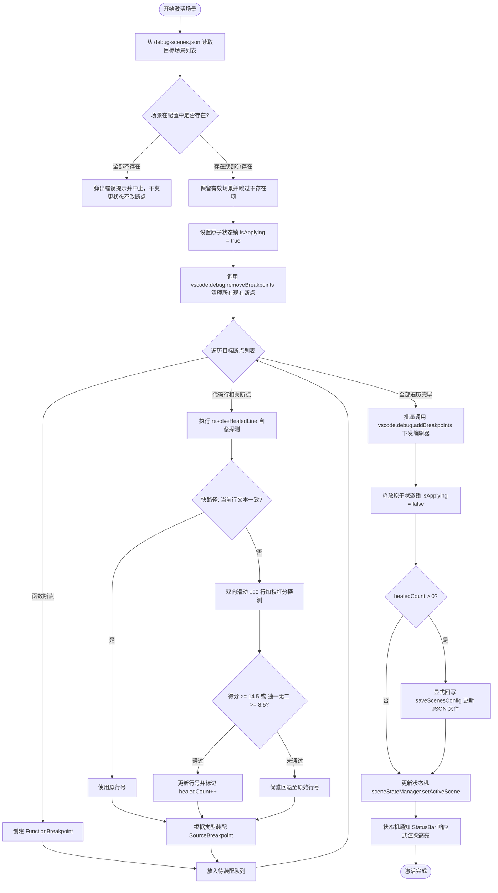
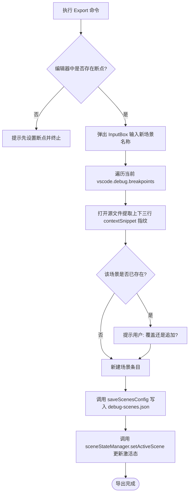
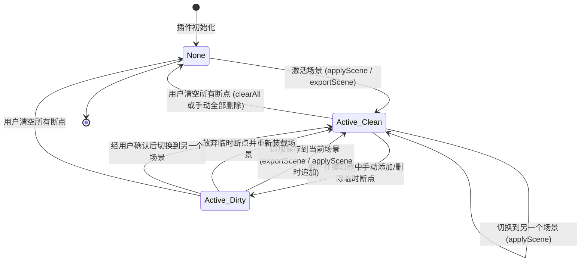

# 业务流程与状态机 (Flows & State Machine)

> **TL;DR**: 核心流程：**场景断点激活装配流**（清理杂散 → 自愈探测 → DAP 装配 → 回写配置 → 驱动视图）、**反向导出流**。核心状态机：**全局场景状态机**（None ↔ Active(SceneName)）。⚠️ 关键状态约束：下发阶段必须全程持有原子执行锁，禁止被断点变更事件打断。

---

## 业务流程

### 1. 场景激活与自愈装配主流程

**触发条件**: 
- 用户点击底部状态栏菜单选择场景；
- 在 `.vscode/debug-scenes.json` 中点击 CodeLens `▶ Apply Scene`；
- 在命令面板执行 `sceneBreakpoints.applyScene`；
- `launch.json` 启动前通过 `"env": { "DEBUG_SCENE": "xxx" }` 预先注入。

---

### 2. 反向批量导出流程

**触发条件**: 在状态栏菜单选择 `Export Active Breakpoints as Scene...` 或右键执行导出命令。

---

## 状态机

### 全局场景激活状态机 (Scene State Machine)

**初始状态**: `None`（未激活任何场景）

### 状态说明

| 状态 | 含义 | 状态栏显示 | 允许的操作 |
|------|------|------------|------------|
| `None` | 工作区未锁定任何场景断点 | `⚪ Scene: (None)` | 激活场景、导出断点、打开配置 |
| `Active(Clean)` | 当前工作区断点与指定场景 100% 同步 | `🟢 Scene: [sceneName]` | 切换场景、追加断点、清空断点、导出更新 |
| `Active(Dirty)` | 当前工作区存在未保存到场景的临时断点 | `🟢 Scene: [sceneName*]` (醒目橙黄) | 切换前保护弹窗（追加保存/放弃/取消）、导出更新、清空 |

### 转换规则

| 当前状态 | 目标状态 | 触发事件 | 副作用 |
|----------|----------|----------|--------|
| `None` | `Active(Clean)` | 成功执行 `applyScene(A)` 或 `exportScene(A)` | 记录基线断点数，广播 `onDidChangeState`，状态栏变绿 |
| `Active(Clean)` | `Active(Dirty)` | 用户手动在编辑器增删临时断点 | 广播 `isDirty: true`，状态栏变橙黄色并增加星号 `*` |
| `Active(Dirty)` | `Active(Clean)` | 执行重新激活并选择“放弃”或“追加保存” | 同步持久化（若选追加），重置基线断点数，复位星号 |
| `Active(Dirty)` | `Active(B)` | 切换到场景 B 并在弹窗中选择放弃或保存 | 保护用户临时断点，切换到目标场景 B |
| `Active(*)` | `None` | 执行 `clearAll` 或编辑器内原生断点数归零（非下发中） | 广播 `activeScene: undefined`，状态栏复位为灰色 (None) |

### 禁止的转换

| 当前状态 | 目标状态 | 禁止原因 | 防护手段 |
|----------|----------|----------|----------|
| `Active(A)` 切换中 | `None` (瞬态) | 在下发场景断点清除旧断点期间，严禁向外暴露未激活状态 | `sceneStateManager.isApplying` 原子锁保护 |
| `Active(Dirty)` | `Active(B)` (无提示直接清除) | 严禁在未询问用户意愿的前提下直接暴力清除用户手动打下的临时断点 | `applySceneCommand` 模态保护弹窗（放弃/追加保存/取消） |
| `None` / 任意状态 | `Active(不存在场景)` | 严禁将 `debug-scenes.json` 中不存在的幽灵场景设为主状态，防止状态栏虚假染绿与断点误清空 | `applySceneCommand` 存在性强校验守卫与 `resolveLaunchBoundScenes` 防御性过滤 |

---

## 变更记录

| 日期 | 变更内容 | 变更人 | 关联变更 |
|------|----------|--------|----------|
| 2026-09-08 | 初始版本 | Tony.L | KDD-INIT-001 |
| 2026-09-08 | 引入断点脏状态（Clean ↔ Dirty）与防误清保护转换路径 | Tony.L | KDD-STATE-004 |
| 2026-09-08 | 确立幽灵场景存在性校验分支与禁止转换为虚假激活状态规则 | Tony.L | KDD-DEFENSE-001 |
