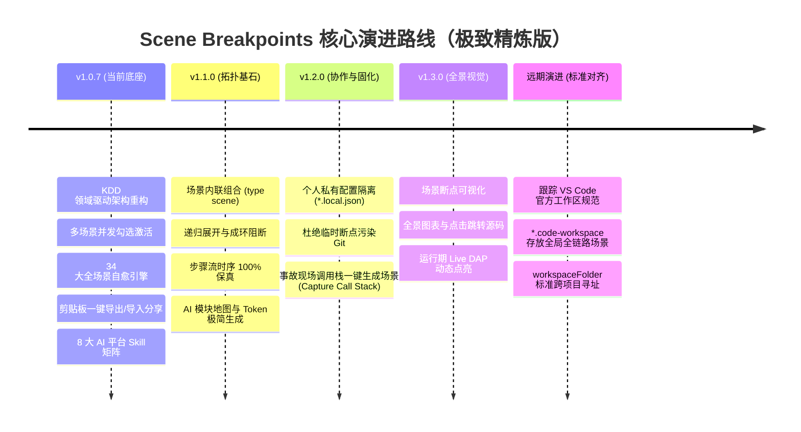

# Scene Breakpoints 功能演进路线图 (Roadmap)

> **核心定位**：轻量级场景化断点编排器，专为**代码研读、执行链路追踪与 AI Agent 协同**打造。  
> 本文档坚持极简主义与真实价值导向，摒弃任何形式的伪需求与功能镀金，汇总插件在完成 v1.0.7 基础底座（纯领域驱动 KDD 重构、多场景并发激活、34 大极限自愈引擎、剪贴板一键导出/导入分享、8 大平台 AI Skill 矩阵）后的核心演进主线。

---

## 目录

- [一、核心演进里程碑一览 (Milestones Overview)](#一核心演进里程碑一览-milestones-overview)
- [二、v1.1.0 数据与拓扑基石 (Data & Composition)](#二v110-数据与拓扑基石-data--composition)
  - [1. 场景组合与内联引用引擎 (Scene Composition with `type: "scene"`)](#1-场景组合与内联引用引擎-scene-composition-with-type-scene)
  - [2. AI 模块地图规则升级 (AI Architectural Map)](#2-ai-模块地图规则升级-ai-architectural-map)
- [三、v1.2.0 团队协作与现场固化 (Collaboration & Retention)](#三v120-团队协作与现场固化-collaboration--retention)
  - [3. 团队公共场景与个人私有配置隔离 (`*.local.json`)](#3-团队公共场景与个人私有配置隔离-localjson)
  - [4. 事故现场逆向固化：调用栈一键生成场景 (Capture Call Stack)](#4-事故现场逆向固化调用栈一键生成场景-capture-call-stack)
- [四、v1.3.0 全景视觉与动态画布 (Visual Graph & Map)](#四v130-全景视觉与动态画布-visual-graph--map)
  - [5. 场景断点可视化 (全景交互与跳转)](#5-场景断点可视化-全景交互与跳转)
- [五、远期标准对齐：多根工作区全链路编排 (Multi-root Workspace Protocol)](#五远期标准对齐多根工作区全链路编排-multi-root-workspace-protocol)
  - [6. 深度契合 VS Code 官方标准的多根全链路场景](#6-深度契合-vs-code-官方标准的多根全链路场景)
- [六、演进优先级矩阵 (Priority Matrix)](#六演进优先级矩阵-priority-matrix)

---

## 一、核心演进里程碑一览 (Milestones Overview)



---

## 二、v1.1.0 数据与拓扑基石 (Data & Composition)

> **核心目标**：彻底解决断点重复定义，单工程内部实现无缝组合复用，并为 AI 提供低 Token 消耗的结构化项目地图。本阶段 100% 聚焦确定性领域逻辑，零外部标准依赖。

### 1. 场景组合与内联引用引擎 (Scene Composition with `type: "scene"`)
- **痛点背景**：
  - 目前每个场景均为独立的断点数组。通用断点（如鉴权拦截、公共 DB 查询）在多个业务场景中被反复复制定义。一旦代码重构行号漂移，需修改多处，极易遗漏；
  - 传统类似面向对象的 `extends: ["auth-core"]` 继承模式存在致命缺陷：它无法处理**真实的执行时序穿插**（例如：先鉴权 → 执行订单解析 → 再开启数据库事务 → 执行订单风控），且导致场景在“数组”与“对象”间分裂。
- **架构实现（多态步骤流模型）**：
  - **100% 保持纯数组结构**：所有场景统一为一维有序步骤数组 `SceneItem[]`，将“子场景引用”与各类断点作为一等公民的**多态步骤节点（Discriminated Union）**：
    ```json
    {
      "scenes": {
        "auth-core": [
          { "type": "line", "file": "src/auth.ts", "line": 45, "desc": "权限校验" }
        ],
        "db-core": [
          { "type": "line", "file": "src/dao.ts", "line": 120, "desc": "SQL 事务开启" }
        ],
        "payment-debug": [
          { "type": "scene", "name": "auth-core", "desc": "步骤 1: 基础鉴权与 Token 校验" },
          { "type": "line", "file": "src/payment.ts", "line": 40, "desc": "步骤 2: 订单参数解析" },
          { "type": "scene", "name": "db-core", "desc": "步骤 3: 开启数据库事务" },
          { "type": "line", "file": "src/payment.ts", "line": 88, "desc": "步骤 4: 订单风控与库存预占" }
        ]
      }
    }
    ```
  - **核心领域解析器 (`src/domain/sceneResolver.ts`)**：
    - **时序因果 100% 保真**：从上往下遍历数组，遇到普通断点直接收集，遇到 `{ type: "scene", name: "..." }` 递归展开目标子场景，步骤前后顺序完全符合代码执行逻辑；
    - **成环拦截**：采用 DFS 递归与 `visited` 集合，遇到直接循环（`A -> A`）或间接多级循环（`A -> B -> C -> A`）抛出 `CircularReferenceError` 阻断激活；
    - **悬空降级**：遇到悬空引用（引用的子场景名不存在）记录轻量警告并跳过，正常下发其余断点，防调试会话中断；
    - **支持子场景级开关 (`enabled: false`)**：支持对整个子场景节点一键开启/禁用，跳过该引用的全量断点下发；
    - **面向未来的扩展性**：基于统一的 `BaseSceneItem { type: string }` 契约，解析器对于未来新增的 UI 分割线（`type: "section"`）、异常断点（`type: "exception"`）或未识别节点均支持优雅降级与分发，具备向前向后完全兼容能力；
  - **侧边栏 UI 树状投影**：树视图以折叠节点清晰展示嵌套子场景片段（`🔗 子场景: auth-core (1)`），点击引用标题支持直接跳转/聚焦至源场景。

---

### 2. AI 模块地图规则升级 (AI Architectural Map)
- **痛点背景**：
  - AI 生成新场景时只能从零生成全部断点，不仅消耗大量 Token，还容易漏掉项目基础链路。
- **架构实现**：
  - 子场景引用结构天然是一张结构化的“项目模块拓扑图”。
  - **生成阶段大幅省 Token**：AI 生成新排查链路时，先检索已有基础场景，直接声明 `{ "type": "scene", "name": "auth-core" }`，仅增量编写 1~2 个关键断点，Token 消耗减少 60%+；
  - **推理阶段直接洞察**：回答“支付与登录流程有什么公共逻辑”时，AI 直接根据场景引用依赖关系秒级推理，无需全盘扫码。

---

## 三、v1.2.0 团队协作与现场固化 (Collaboration & Retention)

> **核心目标**：轻快聚焦于日常协作中真正的硬刚需——杜绝个人调试断点污染 Git 仓库，以及突发 Bug 现场调用栈一键固化。

### 3. 团队公共场景与个人私有配置隔离 (`*.local.json`)
- **痛点背景**：
  - 团队将标准的业务排查场景提交到 Git（`debug-scenes.json`）。开发者排查临时 Bug 时随手新建了 `temp-test` 等临时断点，提交 Git 时一不小心便会污染代码库。
- **架构实现**：
  - 引入分层配置文件机制：
    - `.vscode/debug-scenes.json`（**团队公共场景**，纳入 Git 版本管理）；
    - `.vscode/debug-scenes.local.json`（**个人私有场景**，插件初始化时自动加入 `.gitignore`）；
  - 侧边栏统一聚合加载，开发者既可随时引用团队公共库，又可自由创建个人专属调试场景，彻底杜绝 Git 污染。

---

### 4. 事故现场逆向固化：调用栈一键生成场景 (Capture Call Stack)
- **痛点背景**：
  - 发生异常或断点暂停时，当前线程的调用栈（Call Stack）横跨了多个关键函数。调试一旦终止，事故现场立刻丢失。
- **架构实现**：
  - 调试暂停时，右键提供：`Scene: 将当前调用栈保存为场景断点`；
  - 自动从 DAP 拉取当前堆栈帧，逆向固化为带步骤、带代码指纹的全新场景，瞬态 Bug 秒变工程资产。

---

## 四、v1.3.0 全景视觉与动态画布 (Visual Graph & Map)

> **核心目标**：跳出传统一维列表的限制，提供图形化全景空间感，支持直接点击节点跳转源码以及运行期动态追踪。

### 5. 场景断点可视化 (全景交互与跳转)
- **痛点背景**：
  - 当排查链路跨越多个文件和模块时，一维断点列表无法呈现清晰的空间结构与流向。
- **核心机制**（基于 VS Code 内置 Webview 画布）：
  - **全景图表展示**：直观展现实体依赖与流转关系（具体呈现形式在实施阶段做专项原型设计评测，保持架构弹性）；
  - **点击直达源码**：点击画布上的任意步骤节点，VS Code 编辑器自动平滑滚动高亮目标代码行（自然替代并超越了单纯快捷键盲翻代码的模式）；
  - **运行期动态点亮 (Live DAP Tracking)**：
    - 调试暂停命中断点时，画布对应节点高亮脉冲闪烁，直观感知当前执行进度；
  - **一键图表导出**：支持导出为标准 Mermaid 流程图或 SVG，便于贴入 PR 审阅与技术文档。

---

## 五、远期标准对齐：多根工作区全链路编排 (Multi-root Workspace Protocol)

> **战略决策**：坚决避免自研私有工作区文件协议。将此需求后置，紧密跟踪 VS Code 官方多根工作区与 Agent/Skill 标准演进，成熟时顺水推舟、无缝对齐官方原生规范实现。

### 6. 深度契合 VS Code 官方标准的多根全链路场景
- **官方成熟规范对齐**：
  - **宿主文件标准**：工作区全局场景绝不在磁盘上另起炉灶，严格依照 VS Code 原生规范存放在 `*.code-workspace` 的 `settings["sceneBreakpoints.scenes"]` 中，调用官方 API 原生读写；
  - **跨工程寻址标准**：统一采用官方标准宏 `${workspaceFolder:folderName}/path/to/file` 进行稳定定位；
  - **引用语法统一**：工作区场景跨项目组装时，无缝沿用 `{ "type": "scene", "folder": "featron", "name": "video-pipeline" }`；
- **启动时机**：待 VS Code 官方多根 Workspace 指令与上下文标准全面普及收敛后，正式实施。

---

## 六、演进优先级矩阵 (Priority Matrix)

| 里程碑 | 核心特性 | 价值定位 | 涉及架构分层 |
| :--- | :--- | :--- | :--- |
| **v1.1.0**<br>*(当前研发主线)* | **① 场景组合与内联引用 (`type: "scene"`)**<br>**② AI 模块地图规则升级** | 消除断点冗余、时序因果 100% 保真、大幅节约 AI 生成/推理 Token | `src/domain/sceneResolver.ts`<br>`src/infra/storage/`<br>`src/infra/vscode/`<br>`skills/` |
| **v1.2.0**<br>*(协作与固化)* | **③ 个人私有配置隔离 (`*.local.json`)**<br>**④ 事故调用栈一键生成场景 (Capture Call Stack)** | 杜绝临时断点污染 Git 仓库、瞬态 Bug 现场一键固化沉淀 | `src/infra/storage/`<br>DAP 适配器 |
| **v1.3.0**<br>*(全景视觉)* | **⑤ 场景断点可视化 (Visual Graph & Map)** | 建立时空全景感知、点击节点直接跳转源码、运行期状态脉冲追踪 | VS Code Webview Provider<br>状态机与监听器 |
| **远期演进**<br>*(对齐官方标准)* | **⑥ 多根工作区全链路场景编排** | 遵照 VS Code 原生 `*.code-workspace` 与 `${workspaceFolder:name}` 规范，实现跨工程无痛编排 | VS Code Configuration API<br>多根扫描引擎 |

---
*文档更新于 2026-09-16。坚持极简主义与真实价值导向，先设计契约，后交付实现。*
